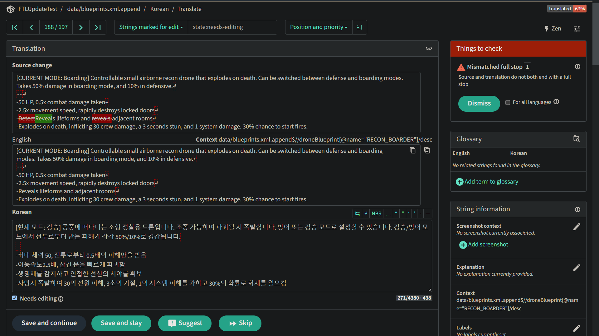
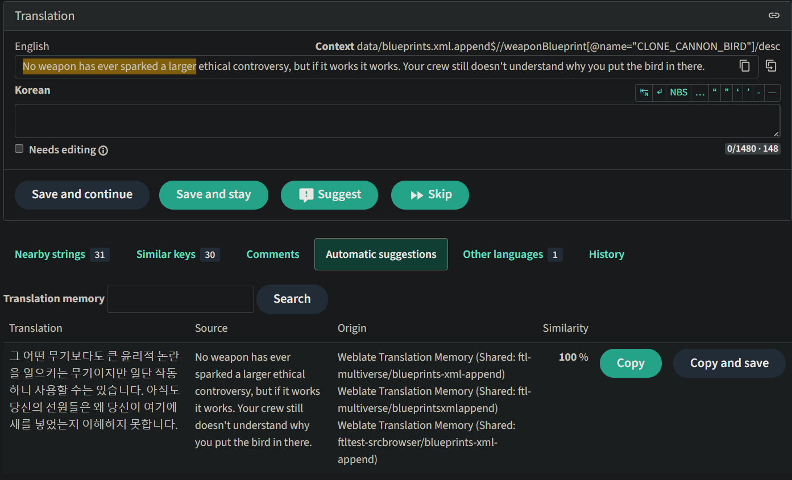

## Test setup

Updated Korean 5.2.1 to 5.2.3 hotfix, with `mvloc batch-generate --update --id-relocation-stragety gsa en`.

## Total stats

Originally there were 21100 translated strings in 5.2.1. It reduced to 20300, which makes the total lost rate of 3.8%.
This includes 430 lost strings and 370 changed strings.

Note that there are some differences in the rate between update algorithms with estimated lost rates as follows:

* Without `--update` (sanitization only): 5.4%
* `--id-relocation-stragety gs`: 3.9%
* `--id-relocation-stragety gsa`: 3.8%
* `--id-relocation-stragety lld`: 3.4%

From top to bottom it gets increased risk of translation being relocated to improper location.

## Changed strings

370 changed strings are automatically marked as fuzzy (aka "Needs Editing") in Weblate,
and they can be searched by `state:needs-editing`.

Each changed entry visually shows how the source changed:

## Lost strings

Lost strings that could not get recovered by ID relocation algorithm are stored in the translation memory,
and can be recovered manually via Automatic suggestions tab:

